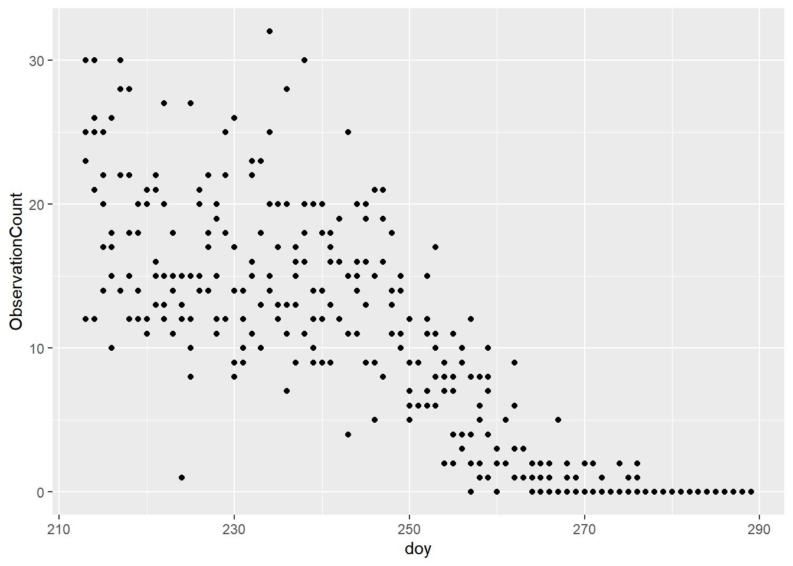

# Data Visualisation {#Visual6}


You have successfully downloaded and summarised your NatureCounts dataset. In this chapter we will demonstrate how to do some basic visualizations with plots. 

## Plotting {#PM6.1}

Plotting your data is a powerful way to detect patterns and make results stand out. Recall in [Chapter 2](#Package2.2) you installed the [tidyverse](https://www.tidyverse.org/) package, which included `ggplot2` for data visualizations. You are encouraged to learn more about this function by reviewing [Cookbook for R](http://www.cookbook-r.com/Graphs/). We also recommend you download a copy of the RStudio [Data Visualization](https://rstudio.com/wp-content/uploads/2015/03/ggplot2-cheatsheet.pdf) cheat sheet as a reference document.

At the end of [Chapter 5](#Manip5) you were exploring fall migration monitoring data collected at [Vaseux Lake Bird Observatory](https://www.birdscanada.org/birdmon/default/datasets.jsp?code=CMMN-DET-VLBO), British Columbia. Let's continue using this dataset for our plotting example and download the data for 2015-present. 

First, lets apply our previously acquired skills to download the filtered dataset and zero-fill for GRCA, while also keep some extra variables. 


```r
library(naturecounts)
library(tidyverse)

VLBO <- nc_data_dl(collections = "CMMN-DET-VLBO", years = c(2015, NA), 
                   username = "sample", info = "tutorial example")

GRCA <- format_zero_fill(VLBO, species = 15900, 
                         by = c("SamplingEventIdentifier", "survey_year", 
                                "survey_month", "survey_day"))
```

First, we are interested if there are any noticeable patterns in migration timing. For this, we will use the [add date and day-of-year helper function](https://birdstudiescanada.github.io/naturecounts/reference/format_dates.html) to add two new columns to the dataframe. 


```r
GRCA_dates <- format_dates(GRCA)
```

Now we can plot raw counts (y-axis) for each day-of-year (x-axis). 


```r
ggplot(data = GRCA_dates) + 
  geom_point(aes(x = doy, y = ObservationCount))
```



What you will notice is that there isn't an obvious peak in migration for this species, but a relatively constant number of individuals counted throughout the season. 

Next, we are interested in visually examining the mean number of migrant GRCA each year, to see if there are any noticeable changes over time. First, we need to summarise the data: 


```r
#use this shortcut function to calculate the standard error
se <- function(x) sd(x) / sqrt(length(x))

GRCA_year <- GRCA %>% 
  group_by(survey_year) %>% 
  summarise(MeanObs = mean(ObservationCount), 
            SEObs = se(ObservationCount)) %>%   
  mutate(yrmin = MeanObs + SEObs, yrmax = MeanObs - SEObs)
```

```
## `summarise()` ungrouping output (override with `.groups` argument)
```

Now we can create the plot: 


```r
ggplot(data = GRCA_year) +  
  geom_pointrange(aes(x = survey_year, y = MeanObs, ymin = yrmin, ymax = yrmax))
```


You will notice there was a increase in the mean number of GRCA observed in th last years. You might now be wondering why.  

## Mapping {#PM6.2}

There is a comprehensive tutorial online for [Mapping Observation](https://birdstudiescanada.github.io/naturecounts/articles/articles/mapping-observations.html). The materials are not repeated here. We encourage you to check this out if are interested in mapping your data! 

