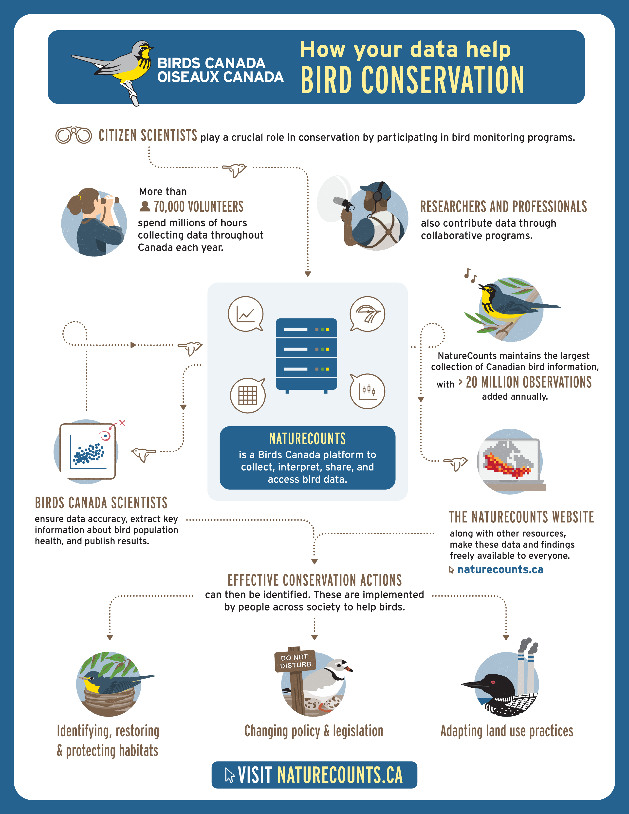

--- 
title: "NatureCounts: An Introductory R Tutorial"
author: "Danielle Ethier"
date: "Version 2: March 2022"
site: bookdown::bookdown_site
documentclass: book
biblio-style: apalike
link-citations: yes
github-repo: BirdsCanada/NatureCounts_IntroTutorial
url: 'https://github.com/BirdsCanada/NatureCounts_IntroTutorial'
description: "Introduction to NatureCounts and associated R Package"
cover-image: NC.png
---

# Welcome to NatureCounts {-}

NatureCounts is the gateway to avian citizen science data collected in North American, with an emphasis on Canadian datasets managed by Birds Canada. The purpose of this workbook is to provide you with the basic tools and skills you will need to get started using the `naturecounts` R package. Let's get started!

